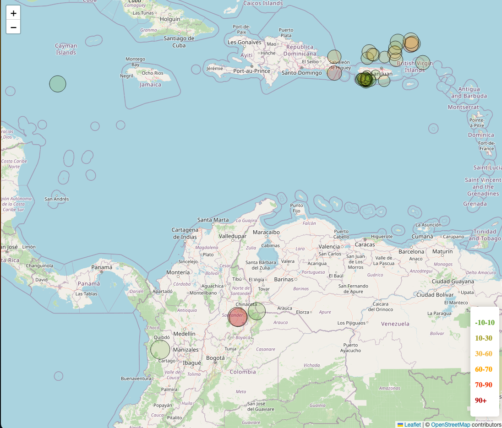

# leaflet-challenge
## Table of Contents

- [Instructions](#instructions)
- [Contents of the Repository](#repository_contents)
- [Questions and Answers](#questions)
- [Givens](#givens)

## Instructions
The United States Geological Survey, or USGS for short, is responsible for providing scientific data about natural hazards, the health of our ecosystems and environment, and the impacts of climate and land-use change. Their scientists develop new methods and tools to supply timely, relevant, and useful information about the Earth and its processes. 
The USGS is interested in building a new set of tools that will allow them to visualize their earthquake data. They collect a massive amount of data from all over the world each day, but they lack a meaningful way of displaying it. In this challenge, you have been tasked with developing a way to visualize USGS data that will allow them to better educate the public and other government organizations (and hopefully secure more funding) on issues facing our planet.

## Repository_Contents
There are 3 coding deliverables. The first is static/js/logic which contains the javascript code for the challenge. It contains all of the manipulation and visualization of the dataset including the creation of layers and markers using leaflet.  
The second is index.html which was mainly given to us, though I made a few changes to better fit my code specifically.  
Finally static/css/style.css which contains the css for the file. It is edited to show the colors for the legend in the bottom right corner. 

## Questions
There were no big questions asked in this challenge. 
Below you will find a sample view of the data  

## Givens
Most of my process was very straight forward. I completed all of the working testing along the way. 
All code was generated by myself or by EDX. 
Dataset created by the United States Geological Survey.  
Data for this dataset and instructions were generated by edX Boot Camps LLC, and is intended for educational purposes only.
